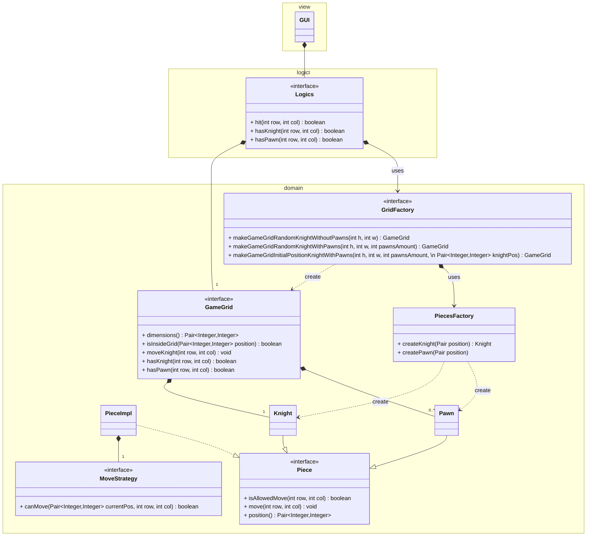
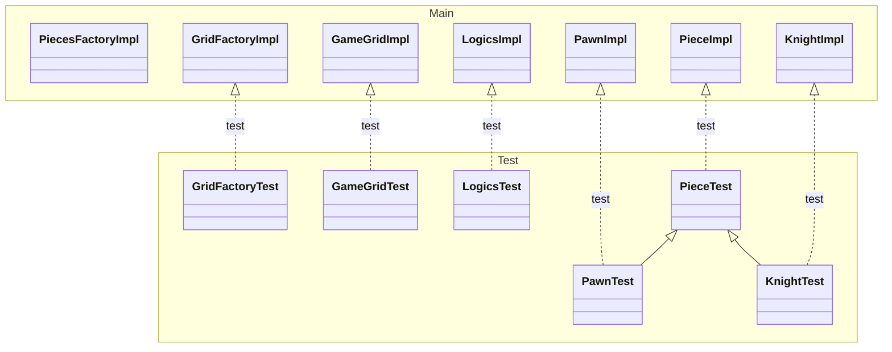

## UML resulting system

## Test Implemented
The following UML shows relationship between test and implemenation classes (fields and methods are omitted). Class `PiecesFactoryImpl` was not developed using TDD approach it hasn't a test class.

